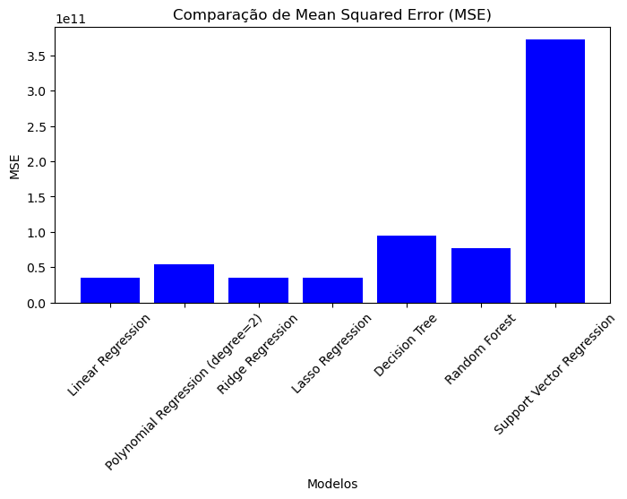
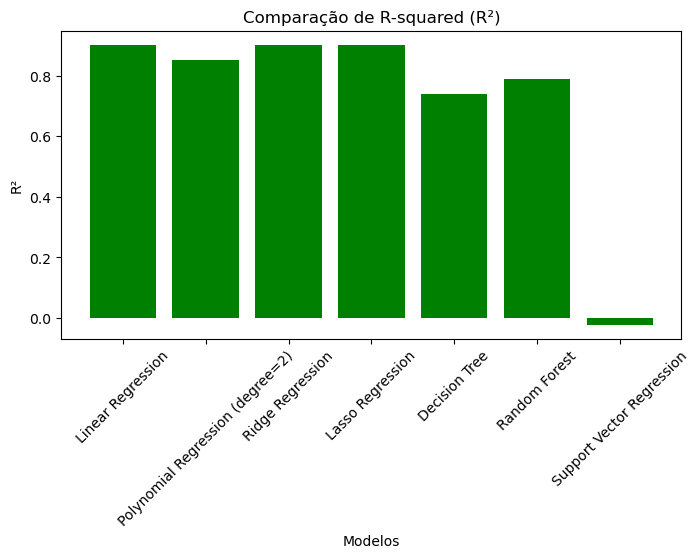
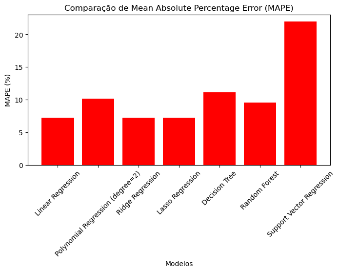

# Análise de Preços de Casas

Este projeto utiliza vários modelos de regressão para prever os preços das casas com base no tamanho da casa. Os modelos avaliados incluem Regressão Linear, Regressão Polinomial, Regressão Ridge, Regressão Lasso, Árvore de Decisão, Floresta Aleatória e Regressão por Vetores de Suporte (SVR).

## Resultados dos Modelos

Os resultados dos modelos foram avaliados utilizando três métricas principais: Mean Squared Error (MSE), R-squared (R²) e Mean Absolute Percentage Error (MAPE). Abaixo estão os resultados obtidos para cada modelo:

### Regressão Linear
- **MSE:** 35,702,944,443.25
- **R²:** 0.9019
- **MAPE:** 7.22%

### Regressão Polinomial (grau=2)
- **MSE:** 54,631,820,405.59
- **R²:** 0.8499
- **MAPE:** 10.19%

### Regressão Ridge
- **MSE:** 35,702,941,037.61
- **R²:** 0.9019
- **MAPE:** 7.22%

### Regressão Lasso
- **MSE:** 35,702,944,325.15
- **R²:** 0.9019
- **MAPE:** 7.22%

### Árvore de Decisão
- **MSE:** 94,833,333,333.33
- **R²:** 0.7395
- **MAPE:** 11.15%

### Floresta Aleatória
- **MSE:** 77,301,031,881.72
- **R²:** 0.7877
- **MAPE:** 9.52%

### Regressão por Vetores de Suporte (SVR)
- **MSE:** 371,984,969,658.93
- **R²:** -0.0218
- **MAPE:** 21.95%

## Visualizações
TO-DO: add images.
### Comparação de MSE

### Comparação de R²

### Comparação de MAPE

## Conclusão

Os resultados mostram que a Regressão Linear, Regressão Ridge e Regressão Lasso tiveram desempenhos muito semelhantes, com altos valores de R² e baixos valores de MAPE. A Regressão Polinomial também apresentou um bom desempenho, mas com um MAPE ligeiramente maior. A Árvore de Decisão e a Floresta Aleatória tiveram desempenhos razoáveis, enquanto a Regressão por Vetores de Suporte (SVR) teve o pior desempenho entre os modelos testados.
